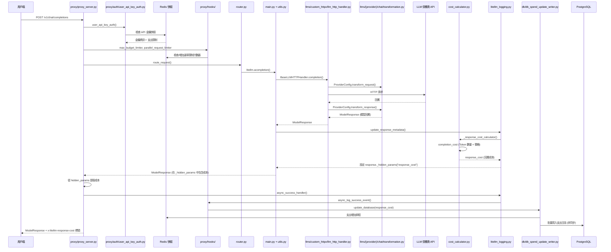
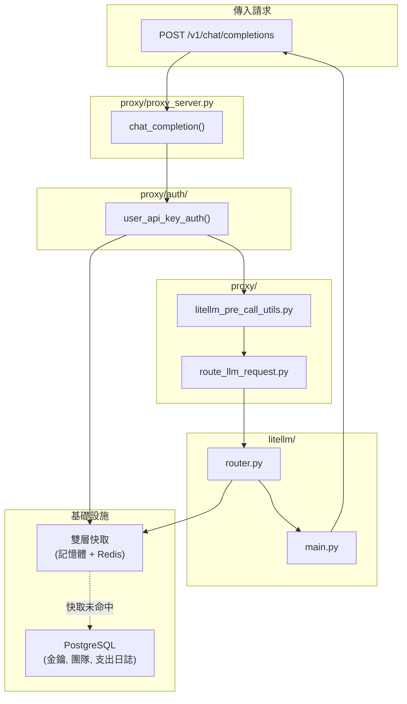
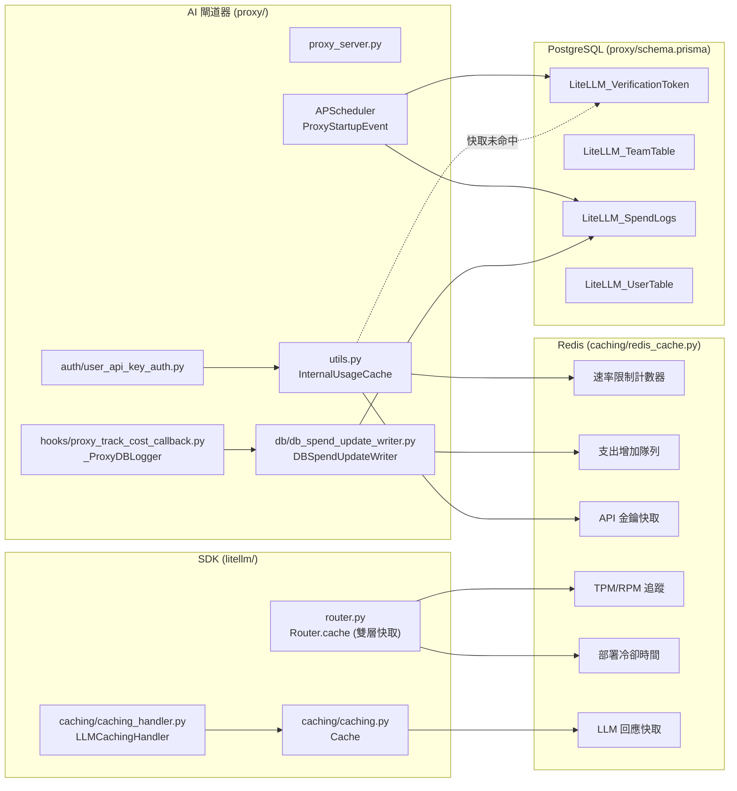
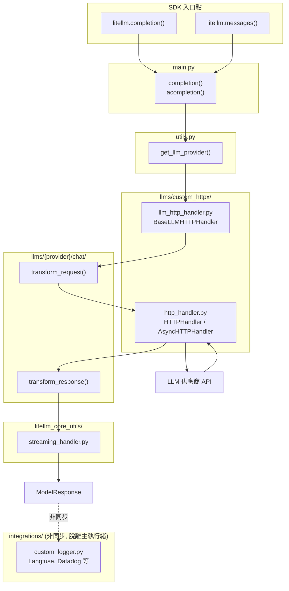

# LiteLLM 架構 - LiteLLM SDK + AI 閘道器 (AI Gateway)

本文件旨在幫助貢獻者了解在 LiteLLM 中進行更改的位置。

---

## 運作原理

LiteLLM AI 閘道器 (Proxy) 在內部使用 LiteLLM SDK 進行所有的 LLM 呼叫：

```
OpenAI SDK (用戶端)    ──▶  LiteLLM AI 閘道器 (proxy/)  ──▶  LiteLLM SDK (litellm/)  ──▶  LLM API
Anthropic SDK (用戶端) ──▶  LiteLLM AI 閘道器 (proxy/)  ──▶  LiteLLM SDK (litellm/)  ──▶  LLM API
任何 HTTP 用戶端        ──▶  LiteLLM AI 閘道器 (proxy/)  ──▶  LiteLLM SDK (litellm/)  ──▶  LLM API
```

**AI 閘道器** 在 SDK 之上增加了身份驗證、速率限制、預算管理和路由功能。
**SDK** 則負責實際的 LLM 供應商呼叫、請求/回應轉換以及串流處理。

---

## 1. AI 閘道器 (Proxy) 請求流程

AI 閘道器 (`litellm/proxy/`) 透過身份驗證、速率限制和管理功能封裝了 SDK。



### Proxy 組件



**核心 Proxy 檔案：**
- `proxy/proxy_server.py` - 主要 API 端點
- `proxy/auth/` - 身份驗證（API 金鑰、JWT、OAuth2）
- `proxy/hooks/` - Proxy 級別的回調 (Callbacks)
- `router.py` - 負載平衡、回退機制 (Fallbacks)
- `router_strategy/` - 路由演算法（`lowest_latency.py`、`simple_shuffle.py` 等）

**LLM 特定 Proxy 端點：**

| 端點 | 目錄 | 用途 |
|----------|-----------|---------|
| `/v1/messages` | `proxy/anthropic_endpoints/` | Anthropic Messages API |
| `/vertex-ai/*` | `proxy/vertex_ai_endpoints/` | Vertex AI 直通 (Passthrough) |
| `/gemini/*` | `proxy/google_endpoints/` | Google AI Studio 直通 |
| `/v1/images/*` | `proxy/image_endpoints/` | 圖像生成 |
| `/v1/batches` | `proxy/batches_endpoints/` | 批量處理 |
| `/v1/files` | `proxy/openai_files_endpoints/` | 檔案上傳 |
| `/v1/fine_tuning` | `proxy/fine_tuning_endpoints/` | 微調任務 |
| `/v1/rerank` | `proxy/rerank_endpoints/` | 重排序 (Reranking) |
| `/v1/responses` | `proxy/response_api_endpoints/` | OpenAI Responses API |
| `/v1/vector_stores` | `proxy/vector_store_endpoints/` | 向量儲存 |
| `/*` (直通) | `proxy/pass_through_endpoints/` | 直接供應商直通 |

**Proxy 鉤子 (Hooks)** (`proxy/hooks/__init__.py`)：

| 鉤子 | 檔案 | 用途 |
|------|------|---------|
| `max_budget_limiter` | `proxy/hooks/max_budget_limiter.py` | 強制執行預算限制 |
| `parallel_request_limiter` | `proxy/hooks/parallel_request_limiter_v3.py` | 按金鑰/使用者限制速率 |
| `cache_control_check` | `proxy/hooks/cache_control_check.py` | 快取驗證 |
| `responses_id_security` | `proxy/hooks/responses_id_security.py` | 回應 ID 驗證 |
| `litellm_skills` | `proxy/hooks/skills_injection.py` | 技能注入 |

要加入新的 Proxy 鉤子，請實作 `CustomLogger` 並在 `PROXY_HOOKS` 中註冊。

### 基礎設施組件

AI 閘道器使用外部基礎設施進行持久化和快取：



| 組件 | 用途 | 關鍵檔案/類別 |
|-----------|---------|-------------------|
| **Redis** | 速率限制、API 金鑰快取、TPM/RPM 追蹤、冷卻時間、LLM 回應快取、支出排隊 | `caching/redis_cache.py` (`RedisCache`), `caching/dual_cache.py` (`DualCache`) |
| **PostgreSQL** | API 金鑰、團隊、使用者、支出日誌 | `proxy/utils.py` (`PrismaClient`), `proxy/schema.prisma` |
| **InternalUsageCache** | Proxy 級別的速率限制 + API 金鑰快取（記憶體 + Redis） | `proxy/utils.py` (`InternalUsageCache`) |
| **Router.cache** | TPM/RPM 追蹤、部署冷卻時間、用戶端快取（記憶體 + Redis） | `router.py` (`Router.cache: DualCache`) |
| **LLMCachingHandler** | SDK 級別的 LLM 回應/嵌入快取 | `caching/caching_handler.py` (`LLMCachingHandler`), `caching/caching.py` (`Cache`) |
| **DBSpendUpdateWriter** | 批量更新支出以減少資料庫寫入 | `proxy/db/db_spend_update_writer.py` (`DBSpendUpdateWriter`) |
| **成本追蹤** | 計算並記錄回應成本 | `proxy/hooks/proxy_track_cost_callback.py` (`_ProxyDBLogger`) |

**背景作業** (APScheduler，於 `proxy/proxy_server.py` → `ProxyStartupEvent.initialize_scheduled_background_jobs()` 中初始化)：

| 作業 | 間隔 | 用途 | 關鍵檔案 |
|-----|----------|---------|-----------|
| `update_spend` | 60秒 | 批量將支出日誌寫入 PostgreSQL | `proxy/db/db_spend_update_writer.py` |
| `reset_budget` | 10-12分鐘 | 重設金鑰/使用者/團隊的預算 | `proxy/management_helpers/budget_reset_job.py` |
| `add_deployment` | 10秒 | 從資料庫同步新的模型部署 | `proxy/proxy_server.py` (`ProxyConfig`) |
| `cleanup_old_spend_logs` | cron/間隔 | 刪除舊的支出日誌 | `proxy/management_helpers/spend_log_cleanup.py` |
| `check_batch_cost` | 30分鐘 | 計算批量作業的成本 | `proxy/management_helpers/check_batch_cost_job.py` |
| `check_responses_cost` | 30分鐘 | 計算 Responses API 的成本 | `proxy/management_helpers/check_responses_cost_job.py` |
| `process_rotations` | 1小時 | 自動輪替 API 金鑰 | `proxy/management_helpers/key_rotation_manager.py` |
| `_run_background_health_check` | 持續 | 健康檢查模型部署 | `proxy/proxy_server.py` |
| `send_weekly_spend_report` | 每週 | Slack 支出警報 | `proxy/utils.py` (`SlackAlerting`) |
| `send_monthly_spend_report` | 每月 | Slack 支出警報 | `proxy/utils.py` (`SlackAlerting`) |

**成本歸因流程：**
1. LLM 回應在 `litellm.acompletion()` 完成後返回至 `utils.py` 包裝器。
2. 呼叫 `update_response_metadata()` (`llm_response_utils/response_metadata.py`)。
3. `logging_obj._response_cost_calculator()` (`litellm_logging.py`) 透過 `litellm.completion_cost()` (`cost_calculator.py`) 計算成本。
4. 成本儲存在 `response._hidden_params["response_cost"]` 中。
5. `proxy/common_request_processing.py` 從 `hidden_params` 提取成本並加入回應標頭 (`x-litellm-response-cost`)。
6. `logging_obj.async_success_handler()` 觸發回調，包括 `_ProxyDBLogger.async_log_success_event()`。
7. `DBSpendUpdateWriter.update_database()` 將支出增加排入 Redis 隊列。
8. 背景作業 `update_spend` 每 60 秒將隊列中的支出刷入 PostgreSQL。

---

## 2. SDK 請求流程

SDK (`litellm/`) 提供核心的 LLM 呼叫功能，供直接 SDK 使用者和 AI 閘道器使用。



**核心 SDK 檔案：**
- `main.py` - 入口點：`completion()`、`acompletion()`、`embedding()`
- `utils.py` - `get_llm_provider()` 解析 模型 → 供應商 的對應關係
- `llms/custom_httpx/llm_http_handler.py` - 中央 HTTP 調度器
- `llms/custom_httpx/http_handler.py` - 低階 HTTP 用戶端
- `llms/{provider}/chat/transformation.py` - 供應商特定的轉換邏輯
- `litellm_core_utils/streaming_handler.py` - 串流回應處理
- `integrations/` - 非同步回調（Langfuse、Datadog 等）

---

## 3. 轉換層 (Translation Layer)

當請求進入時，它會經過一個**轉換層**，在不同的 API 格式之間進行轉換。
每種轉換都隔離在獨立的檔案中，便於獨立測試和修改。

### 哪裡可以找到轉換邏輯

| 傳入 API | 供應商 | 轉換檔案 |
|--------------|----------|------------------|
| `/v1/chat/completions` | Anthropic | `llms/anthropic/chat/transformation.py` |
| `/v1/chat/completions` | Bedrock Converse | `llms/bedrock/chat/converse_transformation.py` |
| `/v1/chat/completions` | Bedrock Invoke | `llms/bedrock/chat/invoke_transformations/anthropic_claude3_transformation.py` |
| `/v1/chat/completions` | Gemini | `llms/gemini/chat/transformation.py` |
| `/v1/chat/completions` | Vertex AI | `llms/vertex_ai/gemini/transformation.py` |
| `/v1/chat/completions` | OpenAI | `llms/openai/chat/gpt_transformation.py` |
| `/v1/messages` (直通) | Anthropic | `llms/anthropic/experimental_pass_through/messages/transformation.py` |
| `/v1/messages` (直通) | Bedrock | `llms/bedrock/messages/invoke_transformations/anthropic_claude3_transformation.py` |
| `/v1/messages` (直通) | Vertex AI | `llms/vertex_ai/vertex_ai_partner_models/anthropic/experimental_pass_through/transformation.py` |
| 直通端點 | 全部 | `proxy/pass_through_endpoints/llm_provider_handlers/` |

### 範例：調試提示快取 (Prompt Caching)

如果 `/v1/messages` → Bedrock Converse 的提示快取無效，但 Bedrock Invoke 有效：

1. **Bedrock Converse 轉換**：`llms/bedrock/chat/converse_transformation.py`
2. **Bedrock Invoke 轉換**：`llms/bedrock/chat/invoke_transformations/anthropic_claude3_transformation.py`
3. 比較兩者在 `transform_request()` 中如何處理 `cache_control`。

### 轉換的工作原理

每個供應商都有一個繼承自 `BaseConfig` (`llms/base_llm/chat/transformation.py`) 的 `Config` 類別：

```python
class ProviderConfig(BaseConfig):
    def transform_request(self, model, messages, optional_params, litellm_params, headers):
        # 將 OpenAI 格式 → 供應商格式
        return {"messages": transformed_messages, ...}
    
    def transform_response(self, model, raw_response, model_response, logging_obj, ...):
        # 將 供應商格式 → OpenAI 格式
        return ModelResponse(choices=[...], usage=Usage(...))
```

`BaseLLMHTTPHandler` (`llms/custom_httpx/llm_http_handler.py`) 會呼叫這些方法 —— 您永遠不需要修改處理器本身。

---

## 4. 新增/修改供應商

### 要新增供應商：

1. 建立 `llms/{provider}/chat/transformation.py`
2. 實作包含 `transform_request()` 和 `transform_response()` 的 `Config` 類別
3. 在 `tests/llm_translation/test_{provider}.py` 中加入測試

### 要新增功能（例如提示快取）：

1. 從上述表格中找到對應的轉換檔案
2. 修改 `transform_request()` 以處理新參數
3. 加入單元測試以驗證轉換邏輯

### 測試清單

新增功能時，請驗證其在所有路徑下都能正常運作：

| 測試 | 檔案模式 |
|------|--------------|
| OpenAI 直通 | `tests/llm_translation/test_openai*.py` |
| Anthropic 直接呼叫 | `tests/llm_translation/test_anthropic*.py` |
| Bedrock Invoke | `tests/llm_translation/test_bedrock*.py` |
| Bedrock Converse | `tests/llm_translation/test_bedrock*converse*.py` |
| Vertex AI | `tests/llm_translation/test_vertex*.py` |
| Gemini | `tests/llm_translation/test_gemini*.py` |

### 單元測試轉換邏輯

轉換邏輯被設計為可以在不發起 API 呼叫的情況下進行單元測試：

```python
from litellm.llms.bedrock.chat.converse_transformation import BedrockConverseConfig

def test_prompt_caching_transform():
    config = BedrockConverseConfig()
    result = config.transform_request(
        model="anthropic.claude-3-opus",
        messages=[{"role": "user", "content": "test", "cache_control": {"type": "ephemeral"}}],
        optional_params={},
        litellm_params={},
        headers={}
    )
    assert "cachePoint" in str(result)  # 驗證 cache_control 是否已成功轉換
```
